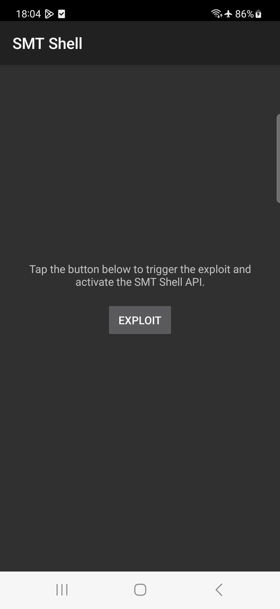
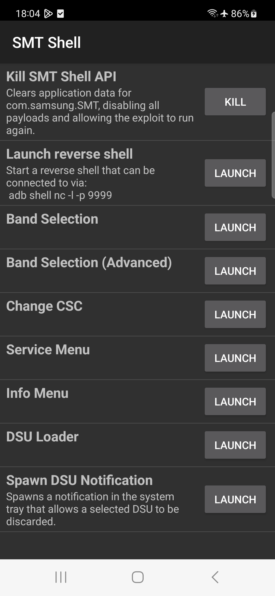

# SMTShell

This tool allows most Samsung devices to achieve a `system` shell (UID 1000). It was patched in OneUI 5.1, but will work on Android 13 running OneUI 5.0 or older. It should work as far back and Android 9.0 (and maybe earlier).

It also acts similar to Magisk or SuperSU, allowing apps to easily execute `system` commands via [SMTShell-API](https://github.com/BLuFeNiX/SMTShell-API/).

<div align="center">
    
     
     
</div>

## Usage (with Shizuku)

Simply run the app and grant Shizuku access.

## Usage (no Shizuku)

1. Downgrade the TTS app to [the version provided](https://raw.githubusercontent.com/BLuFeNiX/SMTShell/master/smtshell/app/src/main/assets/com.samsung.SMT_v3.0.02.2.apk) (this must be done after every reboot):
```
adb install -d com.samsung.SMT_v3.0.02.2.apk
```
Alternatively, you can use `pm install -d /data/local/tmp/com.samsung.SMT_v3.0.02.2.apk` if you copy the file to your device first, via `adb push`

2. Install and open the SMT Shell app, and follow the prompts.

## Licences & Origin

This project started as a fork of [SMT-CVE-2019-16253](https://github.com/flankerhqd/vendor-android-cves/tree/master/SMT-CVE-2019-16253), created by flankerhqd (AKA flanker017). There is also a write-up by flanker [here](https://blog.flanker017.me/text-to-speech-speaks-pwned). Due to the original repo containing multiple unrelated projects, this fork's git history was rewritten using `git filter-repo` so that it only contains the relevant code (and no prebuilt artifacts).

This repo will continue to use the LGPL license that the original used when this fork was created. Other embedded components are licensed as follows:

### Shizuku - Copyright (c) 2021 RikkaW

Some code was copied or adapted from the [Shizuku API](https://github.com/RikkaApps/Shizuku-API) demo project, which is distributed under the MIT License. Primarily, this includes files in `smtshell/app/src/main/java/com/samsung/SMT/lang/smtshell/shizuku`, and the hidden API class stubs in `smtshell/hidden-api-stub`. A copy of the license can be found [here](https://github.com/RikkaApps/Shizuku-API/blob/master/LICENSE).

### Samsung

This project includes an unmodified Samsung APK, at `./smtshell/app/src/main/assets/com.samsung.SMT_v3.0.02.2.apk`.

### Changes from the original

Please see the git commit history for a comprehensive list of changes. Essentially everything was changed, and only the original exploit research remains in spirit.
